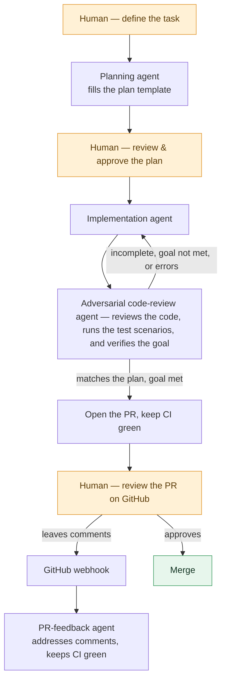

# Ralphy

Ralphy is a multi-agent orchestration tool for engineering teams who want an "AI sandwich" approach: Human at the start & the end, AI in the middle.

It runs as a web UI, is team-first (multi-user), and remote-first (you can run it locally, but it's designed to run on a server).

The tool aims to replicate a typical dev workflow: plan, implement, run the QA scenarios that define the goal, loop until that goal is met (the *Ralph Wiggum loop*), respond to PR comments on GitHub, etc.

It supports Claude Code, Codex, and OpenCode so you can mix and match models on the same task. For example, use Opus for planning, Sonnet for implementation, Codex for code review, and an open-source model to manage the PR (monitor the CI, fix conflicts), etc.


## How it works

Ralphy replicates a normal dev workflow as a loop of specialised agents, with a
human at both ends.



## Running the implementation

### Stack

- React 18 + Vite + Tailwind (frontend)
- Node.js + Express + WebSocket (backend)
- SQLite (better-sqlite3) for metadata and message storage

### Prerequisites

- **Node.js** 18+ (tested on Node 20 and 22)
- **pnpm** 11 — install with `npm install -g pnpm@11`
- **At least one agent runtime** — install whichever provider(s) you plan to
  use:
  - **Claude Code**
  - **Codex**
  - **OpenCode**

> **Notes**
> - Each provider's SDK is a thin wrapper around its CLI, which Ralphy spawns
>   as a subprocess — so the runtime must be installed on the host.
> - You don't need to pre-authenticate Claude Code or Codex; Ralphy's built-in
>   OAuth flow handles login on first use.

### Getting started

```bash
npm install -g pnpm@11      # skip if pnpm 11 is already installed
pnpm install
cp .env.example .env
```

Open `.env` and set `JWT_SECRET` to a random secret:

```bash
openssl rand -hex 64        # paste the output as JWT_SECRET in .env
```

Then run the interactive setup and start the server:

```bash
pnpm onboarding     # creates your admin account and seeds a sample project
pnpm dev
```

- Frontend: http://localhost:5173
- Backend:  http://localhost:3001

### Connecting a provider

Before your first chat or agent run, Ralphy shows a blocking **Connect a provider** modal — you must connect at least one of Claude Code, Codex, or OpenCode. Credentials are stored per user, so each teammate connects their own Claude/Codex/OpenCode account. Each provider authenticates differently:

- **Claude Code / Codex** — click **Authenticate**, open the generated URL in your browser, authorize, then paste the returned code back into the app. No API key needed; it uses your subscription via OAuth.
- **OpenCode** — paste a Zen API key (from
  [opencode.ai/zen](https://opencode.ai/zen)) into the panel.

### Onboarding wizard

`pnpm onboarding` runs in two steps and is idempotent — re-running it is safe and skips completed steps:

1. **Create an admin account.** Prompts for username and password, stored as a bcrypt hash. The first user is automatically granted admin.
2. **Seed a sample project.** Copies
   [`examples/landing-page/`](examples/landing-page) to
   `~/ralphy-examples/landing-page/`, initializes a git repo there, and adds it to your dashboard with one pending task. This gives you something concrete to point your agent at on your first conversation.

If you'd rather start from your own repo, skip `pnpm onboarding`, run `pnpm dev`,
register an admin via the web UI, and add a project pointing at any git repo on
your machine.

## Yet another orchestration tool

As we were working on this, a bunch of orchestration tools emerged. Variants of the same workflow we were converging on.

- [Conductor](https://www.conductor.build/), by Melty Labs (YC S24).
- [GasTown](https://github.com/steveyegge/gastown), by Steve Yegge.
- [gstack](https://github.com/garrytan/gstack), by Garry Tan.
- [SpecKit](https://github.com/github/spec-kit), by GitHub.
- [Symphony](https://github.com/openai/symphony), by OpenAI.

There is a lot of overlap with what we built. For us, this is a huge confirmation that we were on the right path.

Where Ralphy differs:

**Remote-first and multi-player.** While you can run it on your laptop, Ralphy is remote-first by design — we run it on a shared dev box. 
It supports multiple concurrent users out of the box. 
Side benefit 1: sandboxing autonomous agents on a remote server was easier for us than sandboxing them on each laptop.
Side benefit 2: a lot of non-technical people use it internally.
Side benefit 3: because it's always-on, reacting to GitHub is trivial: a PR review posted on GitHub fires a webhook at the box and kicks off a fresh agent run to address the comments. No laptop needs to be awake.

**Multi-harness.** Ralphy drives Claude Code, Codex, and OpenCode behind one interface, so you can assign a different model to each role on the same task.

**Minimalist UX.** The core ideas are super simple: we are just recreating the typical web developer workflow. And we wanted the tool to reflect that simplicity. 
Side benefit: easy to onboard the whole product team.
